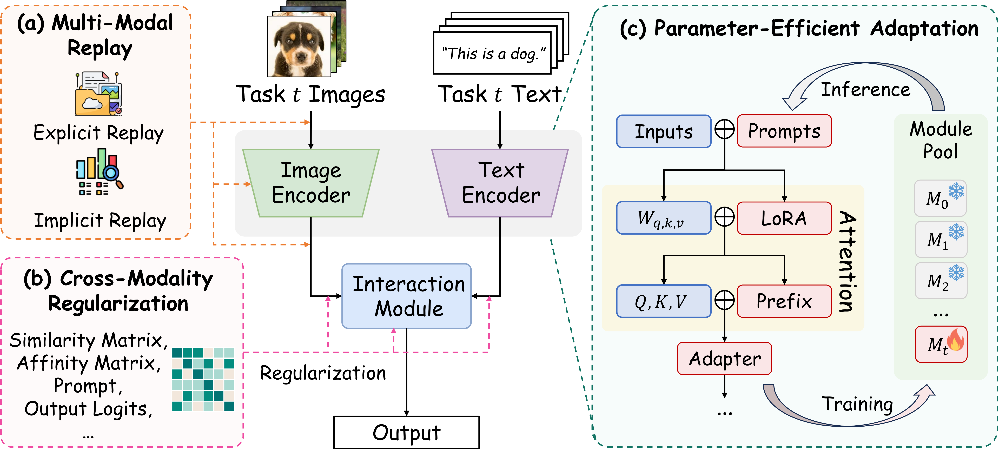
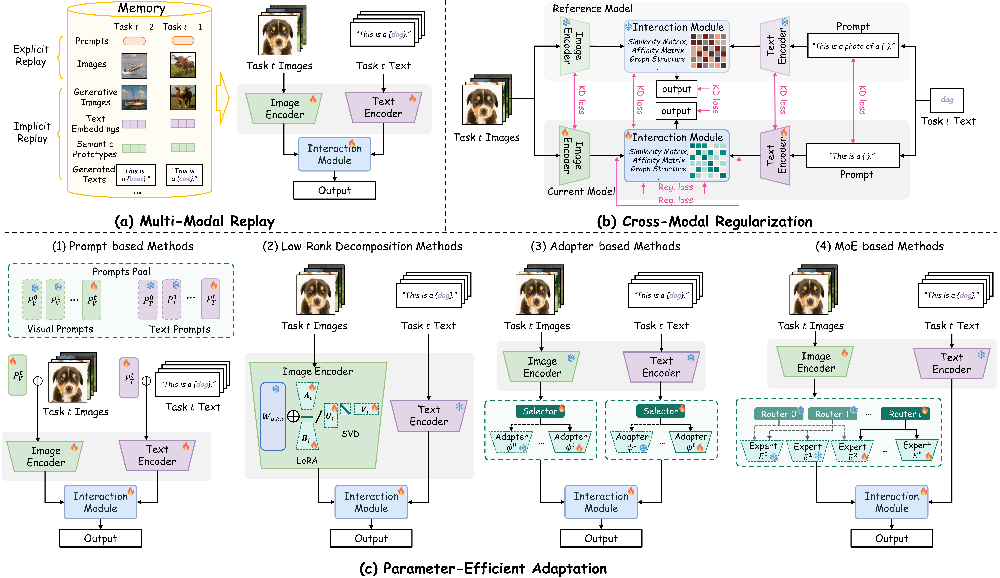
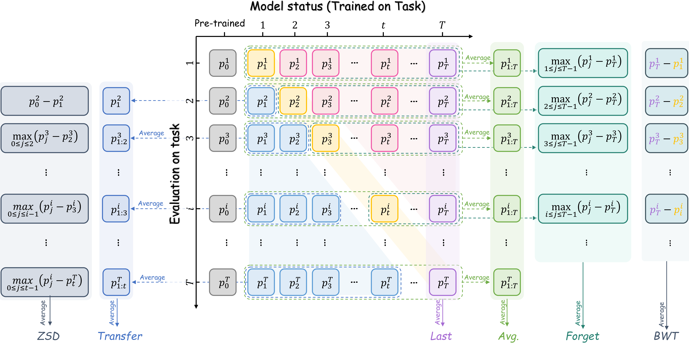

# Awesome Continual Learning for Vision-Language Models 

[](https://arxiv.org/pdf/2508.04227v1.pdf)
[](https://awesome.re)

> A curated list of papers, codebases, and datasets for continual learning in vision-language models (VLMs), accompanying our survey paper.
> *Last updated: 2025-08-12*

<p align="center">
  
</p>

---

## 📣 Citing Our Work
This repository is the official resource hub for our survey paper, **"Continual Learning for VLMs: A Survey and Taxonomy Beyond Forgetting"**. If you find this repository or our survey useful for your research, please consider citing our work:

```bibtex
@article{liu2025continual,
  title={Continual Learning for VLMs: A Survey and Taxonomy Beyond Forgetting},
  author={Liu, Yuyang and Hong, Qiuhe and Huang, Linlan and Gomez-Villa, Alexandra and Goswami, Dipam and Liu, Xialei and van de Weijer, Joost and Tian, Yonghong},
  journal={arXiv preprint arXiv:2508.04227},
  year={2025}
}
```


---

## 📜 Overview
Vision-language models (VLMs) like CLIP have achieved remarkable success, but adapting them to evolving data streams without **catastrophic forgetting** is a critical challenge. This repository provides a systematic review of research on continual learning for VLMs (VLM-CL).

<p align="center">
  
</p>

Our survey identifies three core failure modes in VLM-CL:
- 🧠 **Cross-Modal Feature Drift**: The degradation of alignment between visual and textual feature spaces during updates.
- ⚙️ **Shared Module Interference**: Destructive weight updates in shared components like cross-attention layers, which is common in fusion-based models.
- 📉 **Zero-Shot Capability Erosion**: The loss of generalization to unseen tasks after the model is fine-tuned on specific downstream tasks.

<p align="center">
  
</p>

Based on these challenges, we propose a **solution-driven taxonomy** to categorize existing methods, which forms the structure for the paper list below. This repository serves as a community-driven hub for tracking state-of-the-art methods, datasets, and fostering collaboration.

### 🧠 Multi-Modal Replay (MMRE)
*Strategies that mitigate forgetting by revisiting previous knowledge, either through explicit data storage or implicit generation.*

### ⚙️ Cross-Modal Regularization (CREG)
*Strategies that preserve alignment by imposing constraints on the model's loss function or update process, often using knowledge distillation or by directly regularizing the feature space.*

### 🛠️ Parameter-Efficient Adaptation (PEA)
*Strategies that freeze the main pre-trained model and update only a small number of parameters using prompts, adapters, or low-rank updates to isolate task-specific knowledge.*

---

## 📄 Papers  
*Sorted chronologically (newest first).*  

### 2025
* (ACL) HiDe-LLaVA: Hierarchical Decoupling for Continual Instruction Tuning of Multimodal Large Language Model. [[PDF](https://arxiv.org/pdf/2503.12941)][[CODE](https://github.com/Ghy0501/HiDe-LLaVA)]
* (ICCV) Mind the Gap: Preserving and Compensating for the Modality Gap in CLIP-Based Continual Learning. [[PDF](https://arxiv.org/pdf/2507.09118)][[CODE](https://github.com/linlany/MindtheGap)]
* (ICML) LADA: Scalable Label-Specific CLIP Adapter for Continual Learning. [[PDF](https://arxiv.org/abs/2505.23271)][[CODE](https://github.com/MaolinLuo/LADA)]
* (ICLR) C-CLIP: Multimodal Continual Learning for Vision-Language Model. [[PDF](https://openreview.net/pdf?id=sb7qHFYwBc)][[CODE](https://github.com/SmallPigPeppa/C-CLIP)]
* (CVPR) Synthetic Data is an Elegant GIFT for Continual Vision-Language Models. [[PDF](https://arxiv.org/pdf/2503.04229)][[CODE](https://github.com/Luo-Jiaming/GIFT_CL)]
* (CVPR) Language Guided Concept Bottleneck Models for Interpretable Continual Learning. [[PDF](https://arxiv.org/pdf/2503.23283)][[CODE](https://github.com/FisherCats/CLG-CBM)]
* (TPAMI) Learning without Forgetting for Vision-Language Models. [[PDF](https://arxiv.org/pdf/2305.19270)][[CODE](https://github.com/zhoudw-zdw/PROOF/)]
* (TMM) Visual Class Incremental Learning with Textual Priors Guidance based on an Adapted Vision-Language Model. [[PDF](https://ieeexplore.ieee.org/stamp/stamp.jsp?tp=&arnumber=10897910)][[CODE](https://openi.pcl.ac.cn/OpenMedIA/CIL_Adapterd_VLM)]
* (arXiv) No Images, No Problem: Retaining Knowledge in Continual VQA with Questions-Only Memory. [[PDF](https://arxiv.org/pdf/2502.04469.pdf)][[CODE](https://github.com/IemProg/QUAD)]
* (arxiv) LVP-CLIP: Revisiting CLIP for Continual Learning with Label Vector Pool. [[PDF](https://arxiv.org/pdf/2412.05840)]
* (arxiv) MLLM-CL: Continual Learning for Multimodal Large Language Models. [[PDF](https://arxiv.org/pdf/2506.05453)][[CODE](https://github.com/bjzhb666/MLLM-CL?tab=readme-ov-file)]
* (arXiv) GNSP: Gradient Null Space Projection for Preserving Cross-Modal Alignment in VLMs Continual Learning. [[PDF](https://arxiv.org/pdf/2507.19839.pdf)][[CODE](https://github.com/Ppp-Ttt/GNSP)]

### 2024
* (TMLR) Continual Learning in Open-vocabulary Classification with Complementary Memory Systems. [[PDF](https://arxiv.org/pdf/2307.01430)]
* (ICLR) TiC-CLIP: Continual Training of CLIP Models.[[PDF](https://arxiv.org/pdf/2310.16226)][[CODE](https://github.com/apple/ml-tic-clip)]
* (arxiv) A Practitioner’s Guide to Continual Multimodal Pretraining. [[PDF](https://arxiv.org/pdf/2408.14471)][[CODE](https://github.com/ExplainableML/fomo_in_flux/)]
* (CVPR) Generative Multi-modal Models are Good Class-Incremental Learners. [[PDF](https://arxiv.org/pdf/2403.18383)][[CODE](https://github.com/DoubleClass/GMM)]
* (CVPR) Pre-trained Vision and Language Transformers Are Few-Shot Incremental Learners. [[PDF](https://arxiv.org/pdf/2404.02117)][[CODE](https://github.com/KU-VGI/PriViLege)]
* (arxiv) Adaptive Rank, Reduced Forgetting: Knowledge Retention in Continual Learning Vision-Language Models with Dynamic Rank-Selective LoRA. [[PDF](https://arxiv.org/pdf/2412.01004)]
* (arxiv) Boosting Open-Domain Continual Learning via Leveraging Intra-domain Category-aware Prototype. [[PDF](https://arxiv.org/pdf/2408.09984)]
* (AAAI) Embracing Language Inclusivity and Diversity in CLIP through Continual Language Learning.[[PDF](https://arxiv.org/pdf/2401.17186)][[CODE](https://github.com/yangbang18/CLFM)]
* (AAAI) Continual Vision-Language Retrieval via Dynamic Knowledge Rectification. [[PDF](https://ojs.aaai.org/index.php/AAAI/article/view/29054)]
* (AAAI) Learning Task-Aware Language-Image Representation for Class-Incremental Object Detection. [[PDF](https://ojs.aaai.org/index.php/AAAI/article/view/28537)]
* (AAAI) GCD: Advancing Vision-Language Models for Incremental Object Detection via Global Alignment and Correspondence Distillation [[PDF](https://ojs.aaai.org/index.php/AAAI/article/view/32864)]
* (ECCV) Anytime Continual Learning for Open Vocabulary Classification. [[PDF](https://arxiv.org/abs/2409.08518v1)] [[CODE](https://github.com/jessemelpolio/AnytimeCL)]
* (ECCV) MagMax: Leveraging Model Merging for Seamless Continual Learning. [[PDF](https://arxiv.org/abs/2407.06322)] [[CODE](https://github.com/danielm1405/magmax)]
* (ECCV) Mind the Interference: Retaining Pre-trained Knowledge in Parameter Efficient Continual Learning of Vision-Language Models (DIKI). [[PDF](https://arxiv.org/pdf/2407.05342)] [[CODE](https://github.com/lloongx/DIKI)]
* (ECCV) Adapt without Forgetting: Distill Proximity from Dual Teachers in Vision-Language Models. [[PDF](https://www.ecva.net/papers/eccv_2024/papers_ECCV/papers/07052.pdf)]
* (ECCV) Select and Distill: Selective Dual-Teacher Knowledge Transfer for Continual Learning on Vision-Language Models. [[PDF](https://arxiv.org/pdf/2403.09296)]
* (ECCV) Class-Incremental Learning with CLIP: Adaptive Representation Adjustment and Parameter Fusion. [[PDF](https://arxiv.org/pdf/2407.14143)] [[CODE](https://github.com/linlany/RAPF)]
* (NeurIPS) Advancing Cross-domain Discriminability in Continual Learning of Vision-Language Models (RAIL). [[PDF](https://arxiv.org/pdf/2406.18868)][[CODE](https://github.com/linghan1997/Regression-based-Analytic-Incremental-Learning)]
* (ACM MM) Low-rank Prompt Interaction for Continual Vision-language Retrieval. [[PDF](https://arxiv.org/pdf/2501.14369)][[CODE](https://github.com/Kelvin-ywc/LPI)]
* (IJCAI) Continual Multimodal Knowledge Graph Construction. [[PDF](https://arxiv.org/pdf/2305.08698)] [[CODE](https://github.com/zjunlp/ContinueMKGC)]
* (arXiv) CoLeCLIP: Open-Domain Continual Learning via Joint Task Prompt and Vocabulary Learning. [[PDF](https://arxiv.org/pdf/2403.10245)]
* (NeurIPS) CLAP4CLIP: Continual Learning with Probabilistic Finetuning for Vision-Language Models. [[PDF](https://arxiv.org/pdf/2403.19137.pdf)][[CODE](https://github.com/srvCodes/clap4clip)]
* (arXiv) LW2G: Learning Whether to Grow for Prompt-based Continual Learning. [[PDF](https://arxiv.org/pdf/2409.18860.pdf)][[CODE](https://github.com/raian08/lw2g)]
* (arXiv) ATLAS: Adapter-Based Multi-Modal Continual Learning with a Two-Stage Learning Strategy. [[PDF](https://arxiv.org/pdf/2410.10923.pdf)][[CODE](https://github.com/lihong2303/ATLAS)]
* (arxiv) Exploiting the Semantic Knowledge of Pre-trained Text-Encoders for Continual Learning. [[PDF](https://arxiv.org/pdf/2408.01076)]
* (arxiv) CLIP model is an Efficient Online Lifelong Learner. [[PDF](https://arxiv.org/pdf/2405.15155)]

### 2023
* (AAAI) Symbolic Replay: Scene Graph as Prompt for Continual Learning on VQA Task. [[PDF](https://arxiv.org/pdf/2208.12037)] [[CODE](https://github.com/showlab/CLVQA)]
* (CVPR) Preventing Zero-Shot Transfer Degradation in Continual Learning of Vision-Language Models (ZSCL). [[PDF](https://arxiv.org/abs/2303.06628)] [[CODE](https://github.com/Thunderbeee/ZSCL/tree/main)]
* (CVPR) Boosting Continual Learning of Vision-Language Models via Mixture-of-Experts Adapters. [[PDF](https://arxiv.org/abs/2403.11549)] [[CODE](https://github.com/JiazuoYu/MoE-Adapters4CL)]
* (CVPR) VQACL: A Novel Visual Question Answering Continual Learning Setting. [[PDF](https://openaccess.thecvf.com/content/CVPR2023/papers/Zhang_VQACL_A_Novel_Visual_Question_Answering_Continual_Learning_Setting_CVPR_2023_paper.pdf)] [[CODE](https://github.com/zhangxi1997/VQACL)]
* (ICCV) CTP: Towards Vision-Language Continual Pretraining via Compatible Momentum Contrast and Topology Preservation [[PDF](https://arxiv.org/pdf/2308.07146)] [[CODE](https://github.com/KevinLight831/CTP)]
* (ICCV) Decouple Before Interact: Multi-Modal Prompt Learning for Continual Visual Question Answering [[PDF](https://openaccess.thecvf.com/content/ICCV2023/papers/Qian_Decouple_Before_Interact_Multi-Modal_Prompt_Learning_for_Continual_Visual_Question_ICCV_2023_paper.pdf)]
* (ICCVW) Multimodal Parameter-Efficient Few-Shot Class Incremental Learning. [[PDF](https://arxiv.org/pdf/2303.04751)]
* (ICML) Continual vision-language representation learning with off-diagonal information. [[PDF](https://proceedings.mlr.press/v202/ni23c/ni23c.pdf)] [[CODE](https://github.com/Thunderbeee/ZSCL/tree/main)]
* (ACM MM) Multi-Domain Lifelong Visual Question Answering via Self-Critical Distillation. [[PDF](https://dl.acm.org/doi/pdf/10.1145/3581783.3612121)]
* (arXiv) Class Incremental Learning with Pre-trained Vision-Language Models. [[PDF](https://arxiv.org/pdf/2310.20348.pdf)]

### 2022
* (Neurips) S-Prompts Learning with Pre-trained Transformers: An Occam’s Razor for Domain Incremental Learning. [[PDF](https://arxiv.org/abs/2207.12819)] [[CODE](https://github.com/iamwangyabin/S-Prompts)]
* (Neurips) Climb: A continual learning benchmark for vision-and-language tasks. [[PDF](https://proceedings.neurips.cc/paper_files/paper/2022/file/bd3611971089d466ab4ca96a20f7ab13-Paper-Datasets_and_Benchmarks.pdf)] [[CODE](https://github.com/GLAMOR-USC/CLiMB)]
* (ECCV) Generative Negative Text Replay for Continual Vision-Language Pretraining. [[PDF](https://arxiv.org/pdf/2210.17322)] 
* (arxiv) Continual-CLIP: CLIP is an Efficient Continual Learner. [[PDF](https://arxiv.org/abs/2210.03114)] [[CODE](https://github.com/vgthengane/Continual-CLIP/tree/master)]

---

## 🗂️ Datasets & Benchmarks
Evaluating VLM-CL requires specialized benchmarks. Our survey categorizes them into three tiers: **Repurposed Unimodal**, **Adapted Multimodal**, and **Native VLM-CL** benchmarks. The table below summarizes key datasets used in the literature.

| Dataset          | Task Type              | CL Scenario  | Modality            | Domain                 | # Tasks | Scale (Approx.)              | Link/Source                                                  |
| ---------------- | ---------------------- | ------------ | ------------------- | ---------------------- | ------- | ---------------------------- | ------------------------------------------------------------ |
| **Climb** | VQA, Retrieval         | TIL          | Image+Text          | General                | 4       | 1.1M QA/Pairs                | [[GitHub](https://github.com/GLAMOR-USC/CLiMB)]              |
| **VQACL** | VQA                    | TIL/DIL      | Image+Text          | Scenes & Functions     | 2+      | 100K QA                      | [[GitHub](https://github.com/zhangxi1997/VQACL)]             |
| **COCO-CL** | Detection, Seg, Ret.   | CIL          | Image+Annotations   | Natural Scenes         | 80      | 200K+ Instances              | [[Paper](https://arxiv.org/abs/2007.03337)]                   |
| **TiC-Benchmark**| Retrieval, Class.      | Time-IL      | Image+Text          | Web Crawled            | 9-17    | 12M - 12.7B Pairs            | [[Paper](https://arxiv.org/abs/2310.16226)]                  |
| **MTIL** | Classification         | TIL/CIL      | Image               | 11 Natural Image Sets  | 11      | 438K Images                  | [[Paper](https://arxiv.org/abs/2303.06628)]                  |
| **MDL-VQA** | VQA                    | DIL          | Image+Text          | 5 Visual Domains       | 5       | 150K QA                      | [[Paper](https://dl.acm.org/doi/10.1145/3581783.3612121)]    |
| **ImageNet-CIL** | Classification         | CIL          | Image               | Natural Images         | 10-100  | 1.3M Images                  | [[Link](http://www.image-net.org/)]                          |
| **DomainNet** | Classification         | DIL          | Image               | 6 Domains              | 6       | 600K Images                  | [[Link](http://ai.bu.edu/DomainNet/)]                        |
| **CIFAR100-CIL** | Classification         | CIL          | Image               | Natural Images         | 10      | 60K Images                   | [[Link](https://www.cs.toronto.edu/~kriz/cifar.html)]         |
| **CLEAR** | Classification         | CIL/DIL      | Image               | Temporal Natural Images| 10      | 4.3M - 18.6M Images          | [[Homepage](https://clear-benchmark.github.io/)]             |

#### Notes on CL Scenarios:
- **CIL (Class-Incremental Learning)**: New classes are added in sequential tasks.
- **TIL (Task-Incremental Learning)**: Tasks are distinct, and the task identity is known at inference time.
- **DIL (Domain-Incremental Learning)**: The data distribution shifts across tasks (e.g., photos to sketches), but the task itself remains the same.

### 📊 Evaluation Metrics
Regarding the detailed evaluation metrics (such as average accuracy, forgetting rate, zero-shot capability degradation, etc.), we provide a clear and intuitive diagram (as shown below) in the paper for comprehensive explanation. The diagram details how each metric is calculated.

<p align="center">
  
</p>

---

## 🤝 How to Contribute
We welcome contributions! If you have a paper, dataset, or codebase that should be on this list, please open a **Pull Request**.
1.  Fork the repository.
2.  Add your resource to the appropriate section in `README.md`. Please maintain the existing format.
3.  Submit a pull request with a clear title and description.

---

## 🌟 Related Resources  
- [Awesome Continual Learning](https://github.com/xialeiliu/Awesome-Incremental-Learning)  
- [Awesome Vision-Language Models](https://github.com/jingyi0000/VLM_survey)  

---

## Star History

[](https://www.star-history.com/#YuyangSunshine/Awesome-Continual-learning-of-Vision-Language-Models&type=date&logscale&legend=top-left)

---

## 🛠️ Maintenance
* **Maintainers**: [Yuyang Liu](https://github.com/YuyangSunshine), Qiuhe Hong, [Linlan Huang](https://github.com/linlany), [Alexandra Gomez-Villa](https://github.com/AlexAndorra), and [Dipam Goswami](https://github.com/dipamgoswami).
* **Contact**: sunshineliuyuyang@gmail.com
* *Star the repo to show your support!* ⭐

*Acknowledgments: This repository builds on the incredible efforts of the open-source research community.*


